# TC Lab — WAN Emulator for SD-WAN / Network Labs

A browser-based tool to apply real Linux **tc/netem** impairments to network
interfaces. Built for Fortinet SD-WAN, SASE, and general network lab testing.


---

## ✨ Features

- Apply **latency, jitter, packet loss, duplication, corruption, and rate limiting**
  to any interface in real time
- **Bridges** — impair a whole lab path at once (the bridge shows the round-trip total
  of its two members), or set each side separately
- **802.1Q VLAN** sub-interface management
- **Impairment profiles** — save and load presets (satellite, LTE, MPLS, etc.)
- HTTPS with auto-generated self-signed TLS
- CSRF protection, hardened session cookies, security headers, login rate-limiting
- Light / Dark theme
- Configurable idle session timeout and dashboard port
- **Help built in** — this documentation inside the dashboard, readable offline
- Role-based access — **admin** manages interfaces / bridges / VLANs and user accounts,
  **user** changes impairments
- **User management in the dashboard** (admin-only) + `sudo tc-lab reset-admin-password` recovery
- Runs as a sandboxed systemd service under its own unprivileged user, with only the
  one network capability it needs

---

## 📋 Requirements

| Requirement | Version |
|---|---|
| Linux | Debian 12 / 13, Ubuntu 22.04 / 24.04 — the installer uses `apt` |
| Init system | systemd |
| Python | 3.9 or newer (installed for you) |
| Privileges | root to install; the service runs as its own user, `tc-lab` |

---

## 🚀 Quick Start

```bash
# 1. Clone or download the zip and extract
cd tc-lab

# 2. Run the installer (requires root)
sudo bash setup.sh
```

Full instructions — installation, configuration, service control, logs and
uninstall — are in **[docs/deployment.md](docs/deployment.md)**.
Already running an older version? Follow **[docs/upgrading.md](docs/upgrading.md)**.

`setup.sh` will:
- Install all dependencies (`requirements.txt`)
- Copy the code to `/opt/tc_lab`
- Create the `tc-lab` service user and its state directory, `/var/lib/tc_lab`
- Create a Python virtualenv
- Generate a self-signed TLS cert
- Install and **start the `tc_lab` systemd service automatically**

Open **https://your-server-ip:5000** in your browser. (`sudo bash setup.sh --port 8443`
picks another port.)

> Running the tests: `pip install -r requirements-dev.txt && python -m pytest -q`

> Chrome will warn about the self-signed certificate.
> Click **Advanced → Proceed** to continue, or import `/var/lib/tc_lab/cert.pem` permanently
> via `chrome://settings/certificates` → Authorities → Import → Trust for HTTPS.

**Default credentials:** `admin` / `tclab123`
⚠️ Change your password immediately after first login (Settings → Change Password).

---

## 📚 Documentation

| Document | What it covers |
|---|---|
| [RELEASE_NOTES.md](RELEASE_NOTES.md) | What is new in this version, and what to know before upgrading |
| [docs/user-guide.md](docs/user-guide.md) | **Using TC Lab** — every page of the dashboard, with screenshots |
| [docs/deployment.md](docs/deployment.md) | Installation, **configuration** (`config.json`, TLS, installer options), service control, logs, uninstall |
| [docs/upgrading.md](docs/upgrading.md) | **Upgrading** from v9.x, verifying, and rolling back |
| [docs/users-and-security.md](docs/users-and-security.md) | Accounts, roles, password handling, hardening |
| [SECURITY.md](SECURITY.md) | Security model, fixes, and known limitations |
| [CHANGELOG.md](CHANGELOG.md) | Detailed change history, every version |
| [CONTRIBUTING.md](CONTRIBUTING.md) | Working on TC Lab: tests, screenshots, release checklist |

The same documents are inside the dashboard, under **Help**. On the host,
`tc-lab --help` lists the administration commands.

---

## 🔧 Service Management

```bash
# Status
sudo systemctl status tc_lab

# Start / Stop / Restart
sudo systemctl restart tc_lab

# Logs
journalctl -u tc_lab -n 100

# Code, and everything the service writes
ls /opt/tc_lab/
sudo ls /var/lib/tc_lab/
```

### Account recovery

If no admin can sign in, reset the admin password from a shell on the host:

```bash
sudo tc-lab reset-admin-password
```

Prompts for the new password without echoing it, updates only the `admin`
account, and leaves every other account untouched. `sudo tc-lab list-users`
shows accounts and roles (never hashes); `sudo tc-lab set-port 5000` moves the
dashboard back to port 5000 if it cannot be reached on another.

---

## 🔐 How the service is confined

TC Lab needs network-admin rights for `tc` and `ip`, but not root. Installed as a
service, it runs like this:

| | |
|---|---|
| **User** | its own system user, `tc-lab` — not root, no login shell |
| **Capabilities** | `CAP_NET_ADMIN` only — 1 of root's 40, and it can never gain more. No `CAP_NET_RAW`, `CAP_SYS_ADMIN`, `CAP_SYS_PTRACE`, `CAP_DAC_OVERRIDE`, `CAP_SETUID` or the rest. |
| **Filesystem** | `ProtectSystem=strict`: the whole system is read-only to it except its state directory, `/var/lib/tc_lab`, and a private, throwaway `/tmp`; `ProtectHome=yes`, `PrivateDevices` |
| **Process** | `NoNewPrivileges`, `MemoryDenyWriteExecute`, `RestrictSUIDSGID`, `RestrictNamespaces`, a system-call filter, … |
| **Code** | `/opt/tc_lab` is owned by root and not writable by the service or anyone else |

Check it on a running install:

```bash
ps -o user= -p "$(systemctl show tc_lab -p MainPID --value)"
grep CapEff /proc/$(systemctl show tc_lab -p MainPID --value)/status
```

`tc-lab` and `0000000000001000` mean exactly that user and that one capability.
`systemd-analyze security tc_lab` scores the sandboxing. Kernel modules such as
`8021q` and `sch_htb` are still loaded on demand — by the kernel, not by TC Lab.

---

## 🐳 Docker / containers

**Not supported.** TC Lab installs and runs as a systemd service only; there is no
container image. A container build was prototyped during v9.2 and dropped before
release, for three reasons:

- **There is nothing for a container to isolate.** TC Lab's whole job is to change
  the *host's* real interfaces, so a container would have to share the host's
  network (`--network host`). It gets no network isolation.
- **Its one real benefit is already here.** Containers are safer mainly because
  they drop root's capabilities. The systemd unit does that itself — down to a
  single one, and not as root ([details](#-how-the-service-is-confined)).
- **Installing Docker changes the host networking TC Lab depends on.** Docker loads
  `br_netfilter`, which sends *bridged* frames through iptables, and sets the
  iptables `FORWARD` policy to `DROP`. On a machine whose job is bridging lab
  traffic, that can silently stop traffic crossing your bridges while everything
  still looks correctly configured.

If Docker is already on the host for something else, TC Lab ignores its bridges
(`docker0`, `br-…`) — they never enter saved topology or config exports. Check
whether bridged traffic is being filtered:

```bash
sysctl net.bridge.bridge-nf-call-iptables
```

`1` means it is. `sudo sysctl -w net.bridge.bridge-nf-call-iptables=0` stops it
(add it to a file in `/etc/sysctl.d/` to survive a reboot). If the key does not
exist, `br_netfilter` is not loaded and there is nothing to do.

---

# Configuration

## Create an 🔌 SubInterfaces / VLANs
1.  Physical Interfaces & VLAN Sub-interfaces
    - Make sure your physical interfaces are listed here.
    - Create your SubInterface and VLANs to be used later by a Bridge.


## Create a 🌉 via Bridge Manager
1.  Using the SubInterfaces created in the 🔌 Interfaces / VLANs
    - Pair them with a Bridge; that bridge interface will be configured later with your traffic control.
    - Optionally, you can bridge whole interfaces if you want.


## 🎛  Applying TC Impairments
1. Open the TC Emulation tab
2. Find the interface or bridge you want to impair
3. Set values (0 = disabled for all fields):
   - Latency (ms)    : one-way added delay
   - Jitter (ms)     : random variation on top of latency
   - Loss (%)        : random packet drop rate
   - Duplicate (%)   : probability of packet duplication
   - Corrupt (%)     : probability of single-bit corruption
   - Rate mbit       : bandwidth cap (0 = unlimited)
4. Click Apply
5. Click Reset to remove all impairments

For bridges: the bridge card shows the round-trip total of its two members, and
applying to it splits the values across them. Use "Member controls" to set each
side separately.

Every page of the dashboard — profiles, export/import, users, settings, roles — is
described step by step, with screenshots, in the
**[user guide](docs/user-guide.md)**.

---

## 📦 Included Profiles

| Profile | Simulates | Latency | Jitter | Loss | Duplicate | Corrupt | Rate |
|---|---|--:|--:|--:|--:|--:|--:|
| `good_link` | a near-clean baseline | 5 ms | 1 ms | — | — | — | — |
| `mpls_good` | a good MPLS circuit | 10 ms | 2 ms | — | — | — | 100 mbit |
| `broadband` | typical broadband | 20 ms | 8 ms | 0.1% | — | — | 50 mbit |
| `high_latency_wan` | a slow, distant WAN | 150 ms | 20 ms | 0.5% | — | — | 10 mbit |
| `lte_congested` | congested LTE | 80 ms | 30 ms | 1.5% | 0.2% | — | 2 mbit |
| `satellite_link` | a satellite link | 600 ms | 50 ms | 2% | — | — | 5 mbit |
| `packet_loss` | a lossy but otherwise normal link | 30 ms | 5 ms | 5% | 0.5% | 0.1% | — |
| `wan_degraded` | a badly degraded WAN | 200 ms | 80 ms | 8% | 1% | 0.5% | 1 mbit |

---

## 🔒 Security Notes

> **This tool reconfigures the host's network. Do NOT expose the dashboard (port 5000
> by default) to the public internet.** Intended for **isolated lab environments only.**

- Passwords are bcrypt-hashed; login is rate-limited
- Transport is TLS-encrypted (self-signed cert); cookies are `Secure` + `SameSite=Strict`
- CSRF tokens on every state-changing request; security headers + CSP on every response
- Config-import bundles are fully validated before anything is written or replayed
- Change the default password immediately
- Bind to your management IP (`bind_address` in `/var/lib/tc_lab/config.json`) and
  firewall the dashboard port
- The service runs as its own unprivileged user with 1 capability — see
  [How the service is confined](#-how-the-service-is-confined)

See [SECURITY.md](SECURITY.md) for the security model and known limitations,
and [docs/users-and-security.md](docs/users-and-security.md) for how accounts,
password hashing, roles and hardening actually work.

---

## 🗂 Project Structure

```
tc-lab/
├── app.py              # Main Flask application (routes, validation, CSRF, headers)
├── auth.py             # Auth: login, users, roles, rate-limiter, decorators
├── tc_manager.py       # tc/netem interface (apply, reset, scan)
├── bridge_manager.py   # Linux bridge management
├── vlan_manager.py     # 802.1Q VLAN sub-interface management
├── ssl_gen.py          # Self-signed TLS certificate generator
├── ports.py            # Dashboard port rules (shared by the app and the CLI)
├── help_docs.py        # In-app Help: renders these documents
├── restore_helper.py   # Network restore logic (VLANs → bridges → members)
├── restore_network.sh  # Called by systemd ExecStartPre
├── setup.sh            # installer: code to /opt/tc_lab, state to /var/lib/tc_lab
├── tc_lab.service      # systemd unit (sandboxed)
├── cli.py              # `tc-lab` CLI — admin password recovery, port reset
├── tc-lab              # CLI wrapper, symlinked to /usr/local/bin by setup.sh
├── requirements.txt    # Pinned runtime deps  (requirements-dev.txt adds pytest)
├── RELEASE_NOTES.md    # What's new in this version, upgrade notes
├── CHANGELOG.md        # Full change history
├── profiles/           # Default JSON impairment profiles (seed data)
├── templates/          # HTML templates (index.html, login.html)
├── tools/              # ui-preview.py, capture-screenshots.py (dev helpers)
├── docs/               # user guide, deployment, upgrading, users & security, images
├── tests/              # pytest suite (security, users, managers, installer, help, …)
└── <STATE_DIR>/        # Writable state — /var/lib/tc_lab when installed, the
    ├── config.json         #   current directory when run by hand.
    ├── network_config.json #   All auto-managed. Never commit these.
    ├── state.json          #   Saved impairments, replayed on boot
    ├── users.json          #   bcrypt hashes, created on first run
    ├── secret_key.txt      #   Flask session key
    └── cert.pem / key.pem  #   self-signed TLS
```

---

## 🧪 Tested Use Cases

- Fortinet SD-WAN SLA threshold testing
- FortiGate dual-WAN failover and load balancing validation
- Application performance under degraded WAN conditions
- QoS policy validation (voice, video, critical data)
- SASE / SSE latency impact testing

---

## Screenshots

### TC Emulation — impairments per interface or per bridge
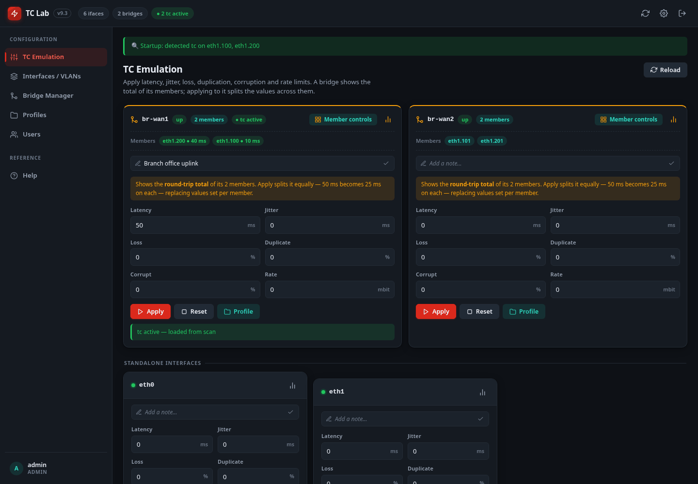

### Member controls — set each side of a bridge; the bridge shows the total
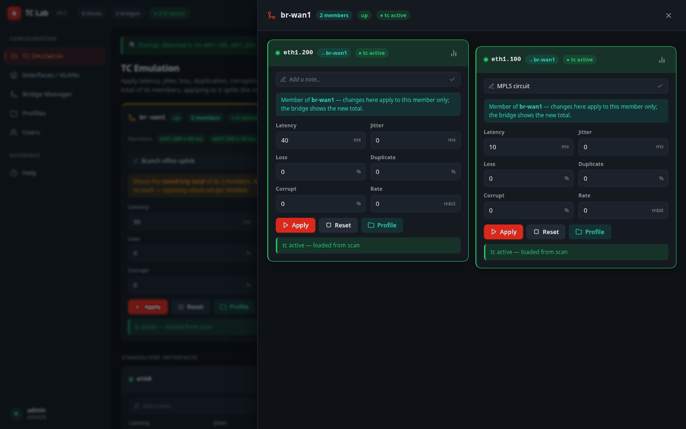

### Interfaces & VLANs — physical NICs with their 802.1Q sub-interfaces
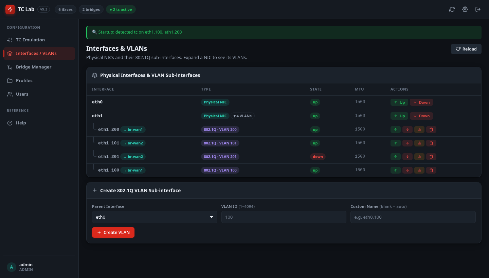

### Bridge Manager — group interfaces into a path
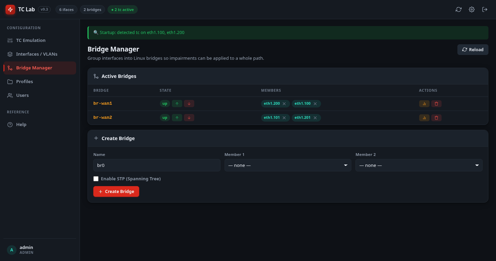

### Profiles & lab config — presets, export and import
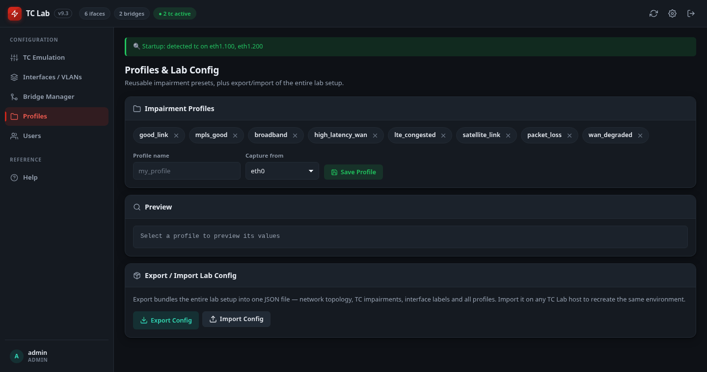

### Live tc statistics
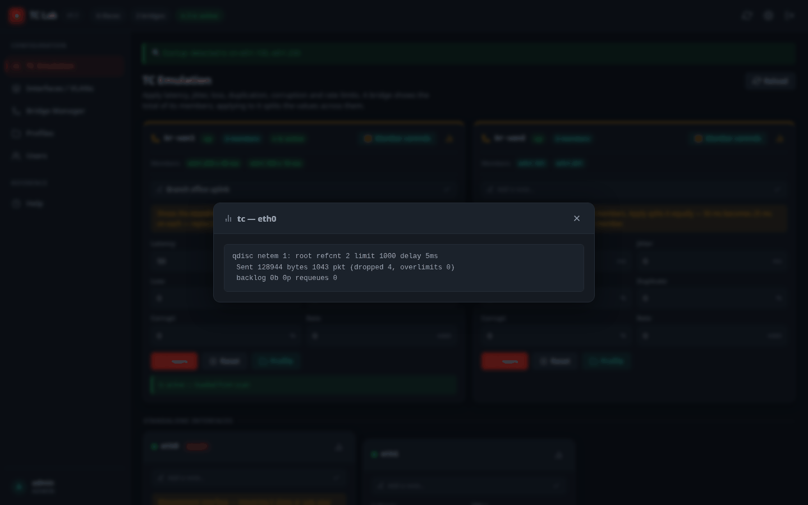

### User Management — admin-only accounts and roles
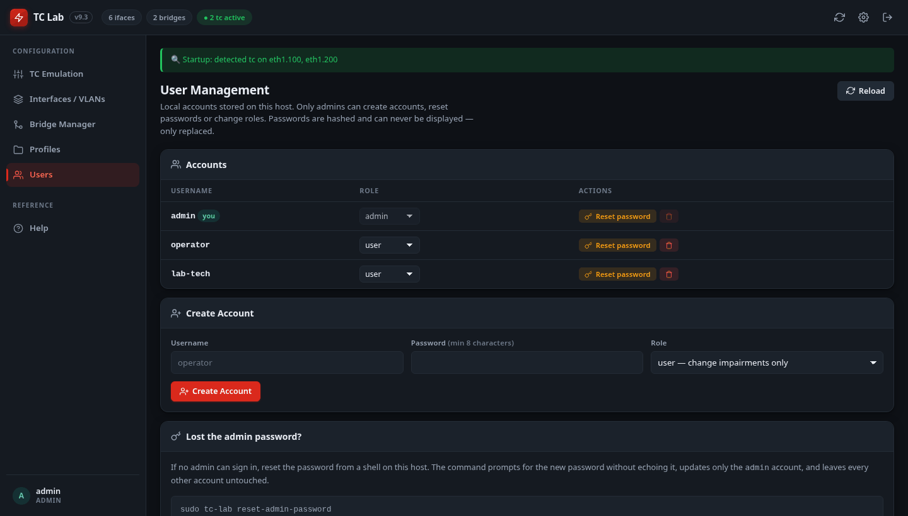

### The same page for a `user` — structural controls hidden
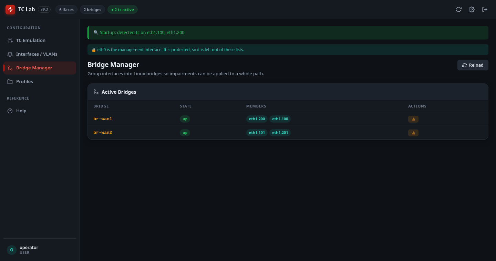

### Settings — password, idle timeout, service port, theme
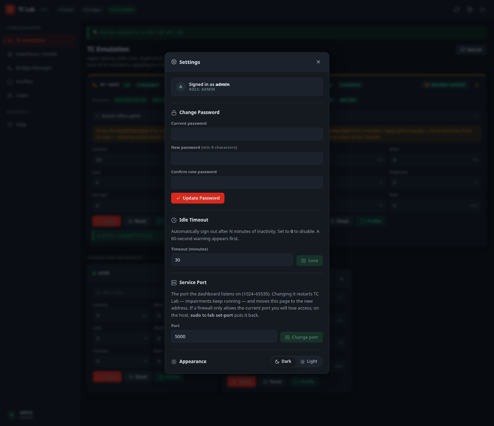

### Help — this documentation, inside the dashboard
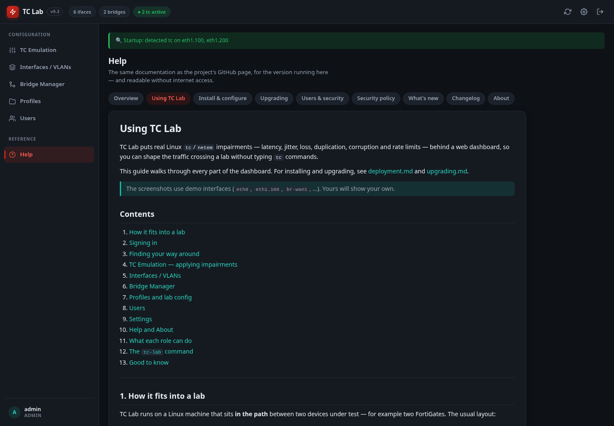

### About — the version you are running, and where it comes from
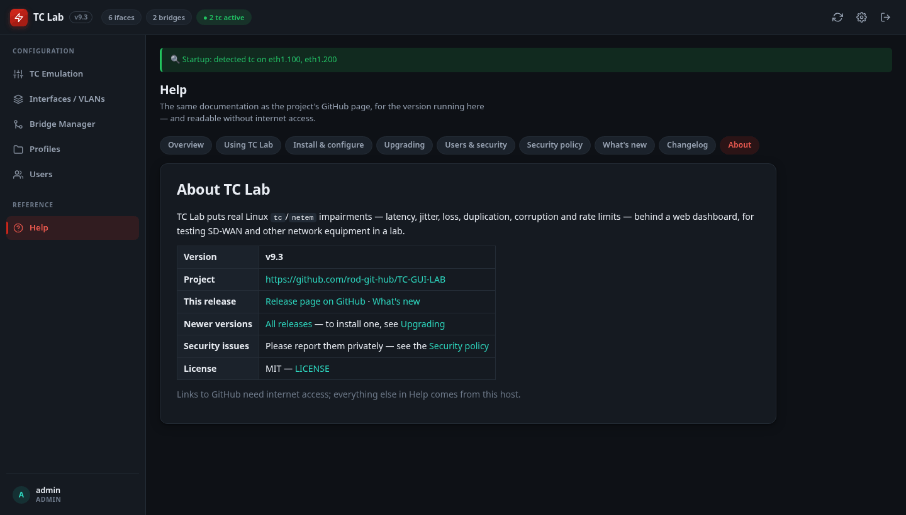

### Sign in
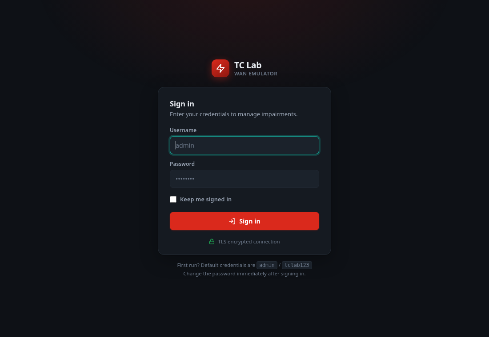

### Light theme
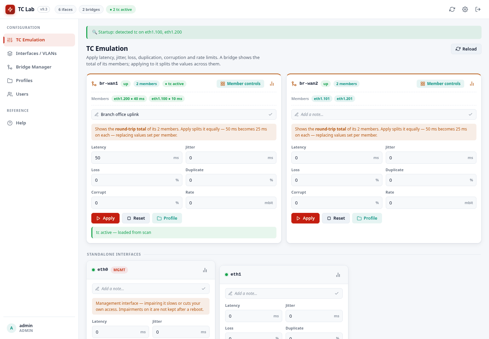

*Screenshots are generated from the UI itself, with demo interfaces, by
`python3 tools/capture-screenshots.py` — re-run it after any UI change so they never
go stale.*

### Reference topology
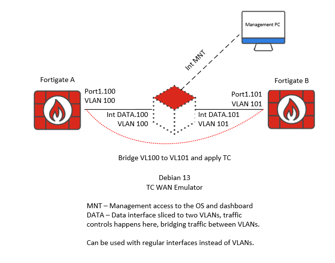

---

## 🤝 Contributing

Pull requests welcome. For major changes, open an issue first. Before you start,
read **[CONTRIBUTING.md](CONTRIBUTING.md)** — how to run the tests, regenerate the
screenshots, and what never goes into a commit.

1. Fork the repo
2. Create a feature branch (`git checkout -b feature/my-feature`)
3. Commit your changes (`git commit -m 'Add my feature'`)
4. Push to the branch (`git push origin feature/my-feature`)
5. Open a Pull Request

---

## 📄 License

[MIT](LICENSE) — free to use, modify, and distribute.
