# Using TC Lab

TC Lab puts real Linux `tc`/`netem` impairments — latency, jitter, loss,
duplication, corruption and rate limits — behind a web dashboard, so you can shape
the traffic crossing a lab without typing `tc` commands.

This guide walks through every part of the dashboard. For installing and upgrading,
see [deployment.md](deployment.md) and [upgrading.md](upgrading.md).

> The screenshots use demo interfaces (`eth0`, `eth1.100`, `br-wan1`, …). Yours
> will show your own.

## Contents

1. [How it fits into a lab](#1-how-it-fits-into-a-lab)
2. [Signing in](#2-signing-in)
3. [Finding your way around](#3-finding-your-way-around)
4. [TC Emulation — applying impairments](#4-tc-emulation--applying-impairments)
5. [Interfaces / VLANs](#5-interfaces--vlans)
6. [Bridge Manager](#6-bridge-manager)
7. [Profiles and lab config](#7-profiles-and-lab-config)
8. [Users](#8-users-admin-only)
9. [Settings](#9-settings)
10. [What each role can do](#10-what-each-role-can-do)
11. [The `tc-lab` command](#11-the-tc-lab-command)
12. [Good to know](#12-good-to-know)

---

## 1. How it fits into a lab

TC Lab runs on a Linux machine that sits **in the path** between two devices under
test — for example two FortiGates. The usual layout:

- a **management** interface you reach the dashboard on, and
- a **data** interface carrying lab traffic, split into VLANs.

You bridge two VLANs together, so traffic flows from one device, through TC Lab, to
the other — and every impairment you set is applied to that traffic.


Plain physical interfaces work too; VLANs just let one NIC carry several paths.

**Keep management traffic off the lab path.** Set `bind_address` so the dashboard
listens only on the management IP — see
[Configuration](deployment.md#4-configuration).

---

## 2. Signing in

Browse to `https://<host>:5000`.

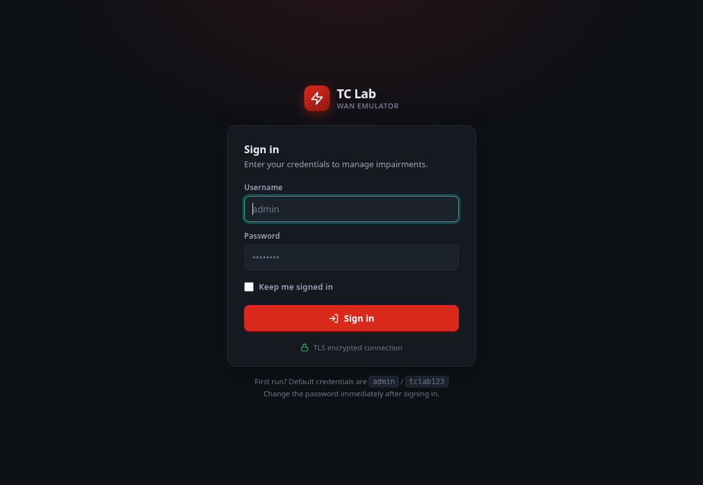

- The first account is **`admin` / `tclab123`**. Change it straight away
  (Settings → Change Password).
- The certificate is self-signed, so the browser warns once. Click **Advanced →
  Proceed**, or install your own certificate
  ([how](deployment.md#tls-certificate)).
- **Keep me signed in** keeps you signed in on that browser for up to 7 days, even
  after it is closed. Leave it unticked on a shared computer.
- Sign-in is limited to 5 attempts per minute; further attempts are refused until
  the minute is up.
- You are signed out automatically after a period of inactivity (30 minutes by
  default), with a 60-second warning first.

---

## 3. Finding your way around

**Top bar**, left to right:

| | |
|---|---|
| **v9.2.1** | the version you are running |
| **6 ifaces** | interfaces you can impair directly — physical NICs and VLAN sub-interfaces |
| **2 bridges** | bridges on the host (their members are the interfaces counted above) |
| **2 tc active** | interfaces with an impairment currently applied |
| ⟳ | refresh everything |
| ⚙ | Settings |
| ⎋ | sign out |

**Sidebar:** TC Emulation, Interfaces / VLANs, Bridge Manager, Profiles, and — for
admins — Users. Your name and role are shown at the bottom.

When the dashboard starts it scans the host, and a green banner lists any interfaces
that already had impairments applied (**"Startup: detected tc on …"**). Those cards
show **"tc active — loaded from scan"**.

---

## 4. TC Emulation — applying impairments

This is where you spend most of your time. There is one card per bridge, then one
per **standalone** interface (an interface that is not a bridge member).

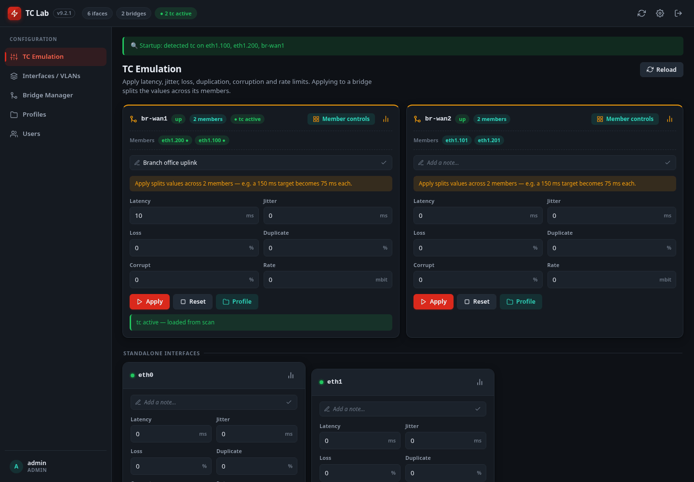

### The fields

| Field | Unit | Range | Effect |
|---|---|---|---|
| Latency | ms | 0 – 60 000 | added one-way delay |
| Jitter | ms | 0 – 10 000 | random variation on top of the latency |
| Loss | % | 0 – 100 | packets dropped at random |
| Duplicate | % | 0 – 100 | packets sent twice |
| Corrupt | % | 0 – 100 | packets with a single-bit error |
| Rate | mbit | 0 – 100 000 | bandwidth cap |

**0 means "off"** for every field. Values outside a range are clamped to it.

- **Apply** sends the values to the kernel immediately.
- **Reset** removes every impairment from that interface or bridge.
- **Profile** fills the fields from a saved profile. It does **not** apply them —
  check the values, then click **Apply**.
- The note box (✎) holds a label of up to 80 characters, such as *"Branch office
  uplink"*.
- The chart icon shows the live `tc` statistics for that interface:

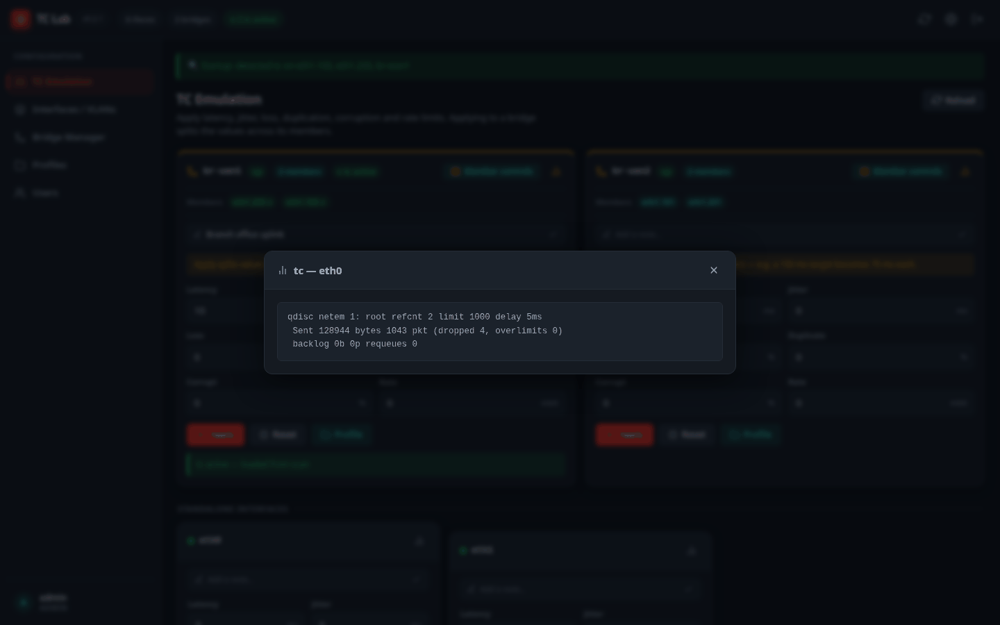

### Impairing a bridge

A bridge card applies the values **across its members**, so the path end to end gets
what you asked for:

- **Latency and jitter are divided** between the members. With two members, a
  150 ms target becomes 75 ms on each.
- **Loss, duplication and corruption are compounded**, not halved: with two members,
  a 2% loss target becomes 1.005% on each, which adds up to exactly 2% across both.
- **Rate is applied to each member unchanged.**

The card reminds you of this: *"Apply splits values across 2 members"*.

### Member controls

**Member controls** on a bridge card opens each member on its own, so you can
fine-tune one side of the path. Each member shows the split value the bridge applied.

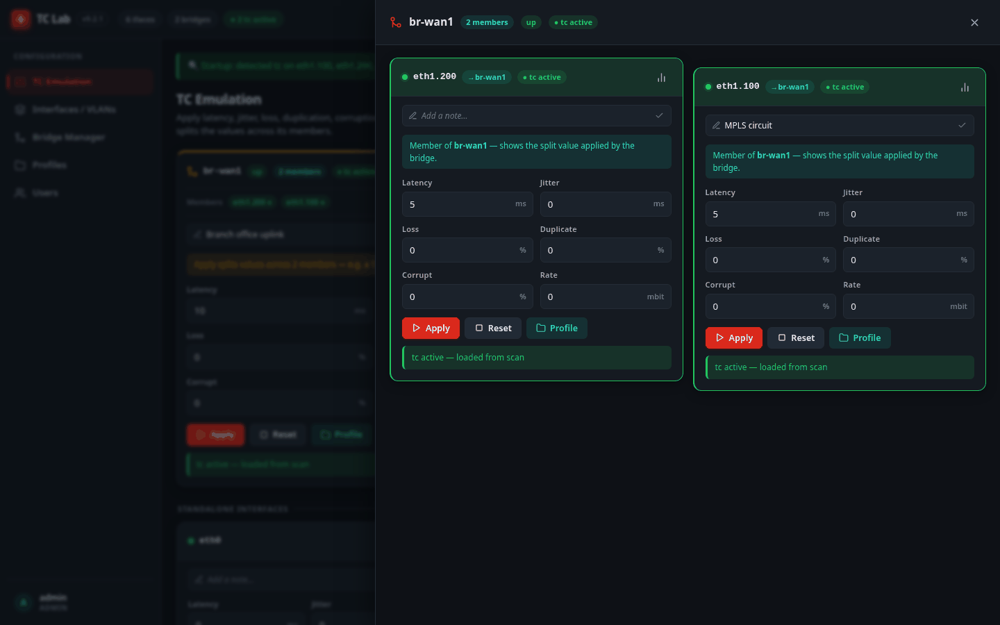

### After a reboot

Impairments are saved and **re-applied automatically** when the service starts, after
the bridges and VLANs have been rebuilt. You do not need to set them again.

---

## 5. Interfaces / VLANs

Your physical NICs, each with its 802.1Q VLAN sub-interfaces underneath.

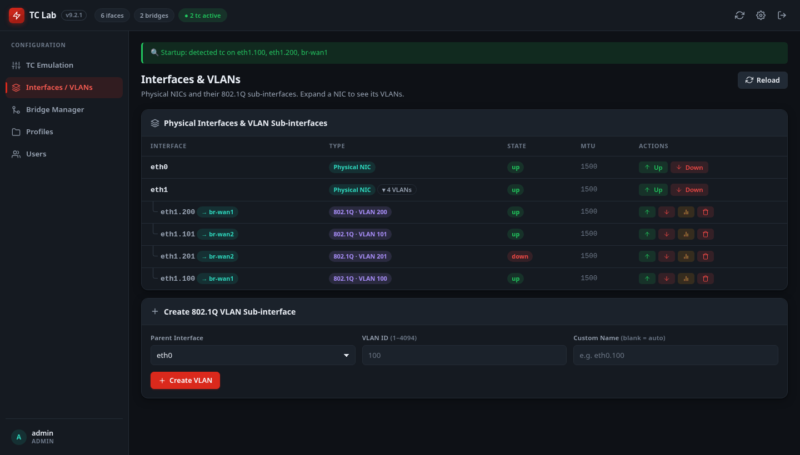

**Create a VLAN** *(admin)*: choose the parent interface, enter a VLAN ID
(1 – 4094), and optionally a name. With no name, it is called `<parent>.<id>` — for
example `eth1.100`.

You can also bring a VLAN up or down, delete it, and view its statistics. Deleting a
VLAN that is a bridge member removes it from the bridge.

**Names** — for VLANs, bridges and profiles alike — may use letters, digits, `.`, `_`
and `-`, must not start with `-` or `.`, and must be plain ASCII. Linux limits
interface and bridge names to **15 characters**.

---

## 6. Bridge Manager

Bridges join interfaces into one path, so traffic passes from one member to the other
through TC Lab.

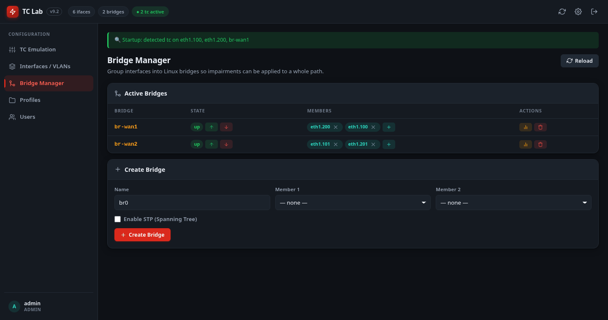

**Create a bridge** *(admin)*: give it a name, pick up to two members from the
interfaces that are not already in a bridge, and create it. STP (Spanning Tree) is off
by default, which is what a simple two-port lab path wants.

On an existing bridge you can:

- add a member (**+**) or remove one (**×** on its tag),
- bring the bridge up (↑) or down (↓),
- view statistics, or delete the bridge.

Bridges, VLANs and their memberships are **saved automatically** after every change
and rebuilt when the machine boots.

Bridges created by other software on the host — `docker0`, libvirt's `virbr0` and
similar — may appear in the list, but TC Lab never saves, exports or recreates them.

---

## 7. Profiles and lab config

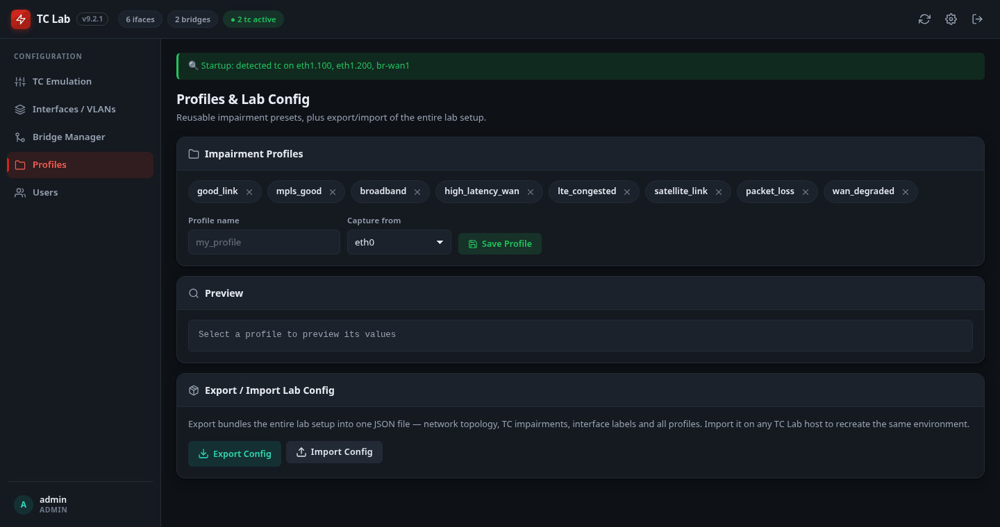

### Impairment profiles

A profile is a named set of values you can load onto any interface or bridge.

- **Save a profile:** type a name, choose the interface to **capture from**, and click
  **Save Profile**. It records the values currently entered for that interface on
  the TC Emulation page — normally what is applied, unless you have edited the
  fields without clicking Apply.
- **Preview:** click a profile to see its values.
- **Delete:** the **×** on its tag.
- **Use one:** the **Profile** button on a TC Emulation card (see
  [section 4](#4-tc-emulation--applying-impairments)).

TC Lab ships with these (a dash means off):

| Profile | Simulates | Latency | Jitter | Loss | Duplicate | Corrupt | Rate |
|---|---|--:|--:|--:|--:|--:|--:|
| `good_link` | a near-clean baseline | 5 ms | 1 ms | — | — | — | — |
| `mpls_good` | a good MPLS circuit | 10 ms | 2 ms | — | — | — | 100 mbit |
| `broadband` | typical broadband | 20 ms | 8 ms | 0.1% | — | — | 50 mbit |
| `high_latency_wan` | a slow, distant WAN | 150 ms | 20 ms | 0.5% | — | — | 10 mbit |
| `lte_congested` | congested LTE | 80 ms | 30 ms | 1.5% | 0.2% | — | 2 mbit |
| `satellite_link` | a satellite link | 600 ms | 50 ms | 2% | — | — | 5 mbit |
| `packet_loss` | a lossy but otherwise normal link | 30 ms | 5 ms | 5% | 0.5% | 0.1% | — |
| `wan_degraded` | a badly degraded WAN | 200 ms | 80 ms | 8% | 1% | 0.5% | 1 mbit |

### Export and import the whole lab

**Export Config** downloads one JSON file (`tc_lab_config_<date>_<time>.json`) holding
the entire setup: bridges and VLANs, impairments, interface notes and every profile.

**Import Config** *(admin)* loads such a file — on the same host to restore it, or on
another TC Lab host to recreate the lab there. Import:

- checks **every** name and value first, and refuses the whole file if anything is
  invalid — nothing is half-imported;
- saves the topology, impairments, notes and profiles, creates any bridges or VLANs
  that do not exist yet, and applies the impairments straight away (a file with no
  topology in it only saves them; they take effect at the next service restart);
- does not change accounts or settings.

Files exported from v9.1 import into v9.2.1, as long as their names follow the rules
in [section 5](#5-interfaces--vlans).

---

## 8. Users *(admin only)*

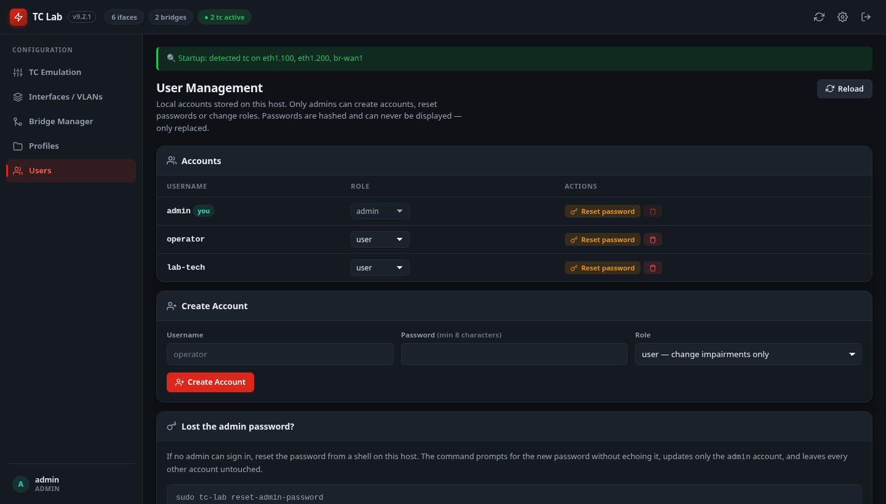

- **Create Account:** username, password and role.
- **Change a role:** pick `admin` or `user` from the list on that account's row.
- **Reset a password:** set a new one for any account. There is no way to *view* a
  password — not here and not anywhere else.
- **Delete** an account.

Built-in safety rails: you cannot delete your own account, remove your own admin
role, or delete or demote the last admin.

**Passwords** must be at least 8 characters and at most 72 bytes, and are stored
only as bcrypt hashes.

---

## 9. Settings

Open it with ⚙ in the top bar.

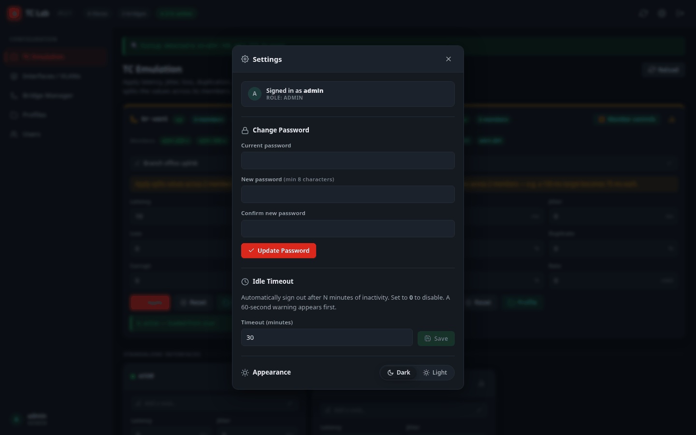

- **Change Password** — your own. Everyone can do this.
- **Idle Timeout** *(admins only — the section is hidden for other users)* — minutes
  of inactivity before sign-out; **0** disables it.
- **Appearance** — dark or light. The choice is remembered by your browser.

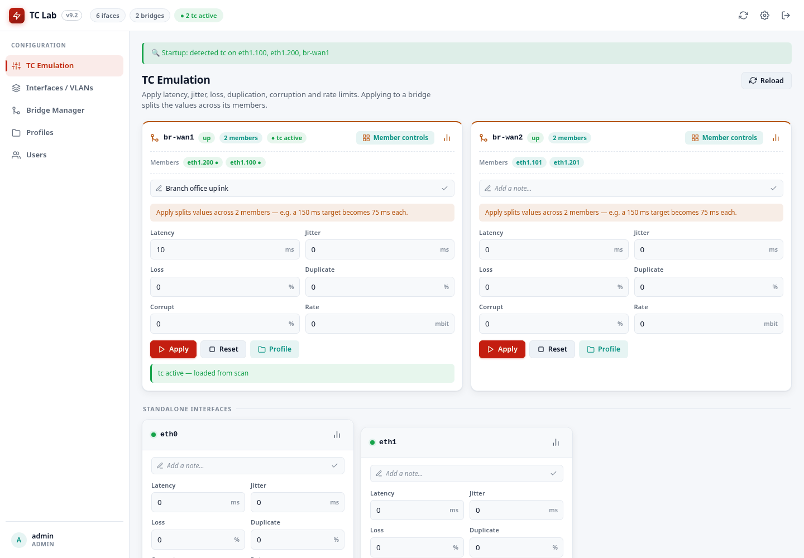

---

## 10. What each role can do

| | `admin` | `user` |
|---|:-:|:-:|
| View interfaces, bridges, VLANs and statistics | ✓ | ✓ |
| Apply and reset impairments | ✓ | ✓ |
| Edit interface notes | ✓ | ✓ |
| Save, load and delete profiles | ✓ | ✓ |
| Export the lab config | ✓ | ✓ |
| Change their own password | ✓ | ✓ |
| Create and delete VLANs and bridges; add and remove members | ✓ | |
| Bring interfaces, VLANs and bridges up or down | ✓ | |
| Import a lab config | ✓ | |
| Change the idle timeout | ✓ | |
| Manage accounts | ✓ | |

A `user` sees the same pages without the controls they cannot use — here, the Bridge
Manager as a `user`:

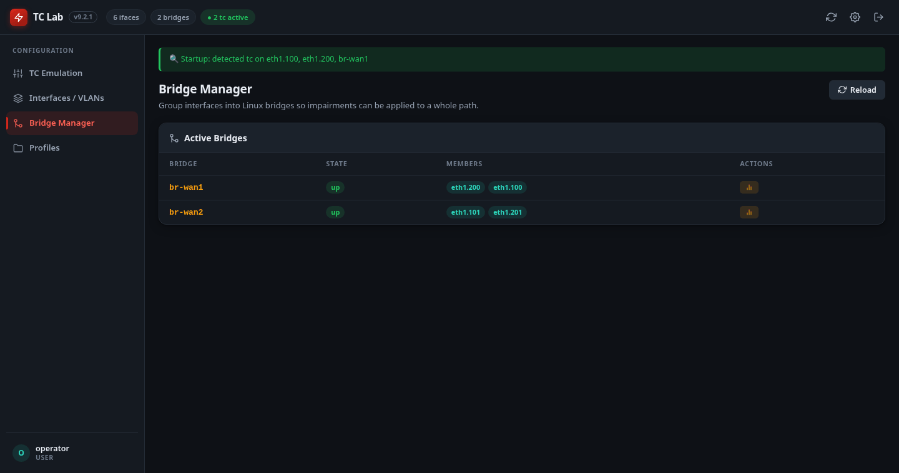

The server enforces these rules itself, so hiding a button is only a convenience — a
`user` cannot get around it.

---

## 11. The `tc-lab` command

On the TC Lab host itself:

```bash
tc-lab --help
```

| Command | What it does |
|---|---|
| `sudo tc-lab reset-admin-password` | set a new password for `admin` when it has been lost |
| `sudo tc-lab list-users` | list accounts and roles (`--json` for scripts) |
| `tc-lab --version` | show the installed version |

The reset asks for the new password twice without showing it, applies the same rules
as the dashboard, backs up the account file first, and changes **only** the `admin`
account — recreating it if it had been deleted.

---

## 12. Good to know

- **Impairments live in the kernel.** Stopping or restarting the service does not
  remove them, and the service re-applies saved ones after a reboot.
- **After an upgrade, hard-refresh the browser** (Ctrl-Shift-R). An old cached page
  makes every action fail with *"The CSRF token is missing."*
- **Keep the dashboard on the management network.** Anyone who can reach port 5000
  can try to sign in; see [users-and-security.md](users-and-security.md).
- **Something not working?** Service logs: `journalctl -u tc_lab -n 100`. More in
  [deployment.md → Troubleshooting](deployment.md#9-troubleshooting).
